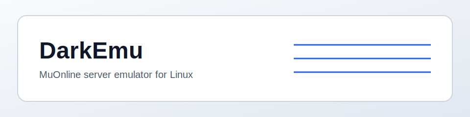
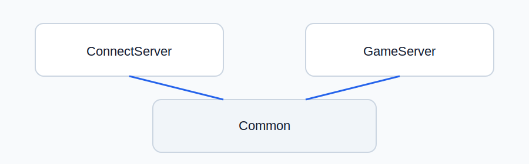
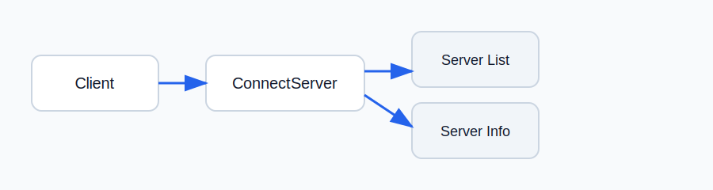

# DarkEmu
MuOnline server emulator with clean, modular networking layers for Linux.

<picture>
  <source media="(prefers-color-scheme: dark)" srcset="docs/images/banner.svg">
  <source media="(prefers-color-scheme: light)" srcset="docs/images/banner-light.svg">
  
</picture>

## Modules
| Module | Role |
| --- | --- |
| ConnectServer | Handles the initial handshake and server list responses. |
| GameServer | Accepts clients and logs the first encrypted packets for validation. |
| Common | Shared socket, epoll, and logging utilities. |

## Configuration
- Server list data lives in `src/Servers/Connect/Data/ServerList.json`.

## Status
- Server foundations in progress.
- ConnectServer responds to server list requests.
- GameServer accepts connections and logs incoming packets.

## Documentation
- `docs/Build.md` - build and test steps
- `docs/ConnectServer.md` - protocol and layout notes
- `docs/GameServer.md` - behavior and defaults

## Visuals
<picture>
  <source media="(prefers-color-scheme: dark)" srcset="docs/images/modules.svg">
  <source media="(prefers-color-scheme: light)" srcset="docs/images/modules-light.svg">
  
</picture>

<picture>
  <source media="(prefers-color-scheme: dark)" srcset="docs/images/connectserver-flow.svg">
  <source media="(prefers-color-scheme: light)" srcset="docs/images/connectserver-flow-light.svg">
  
</picture>
